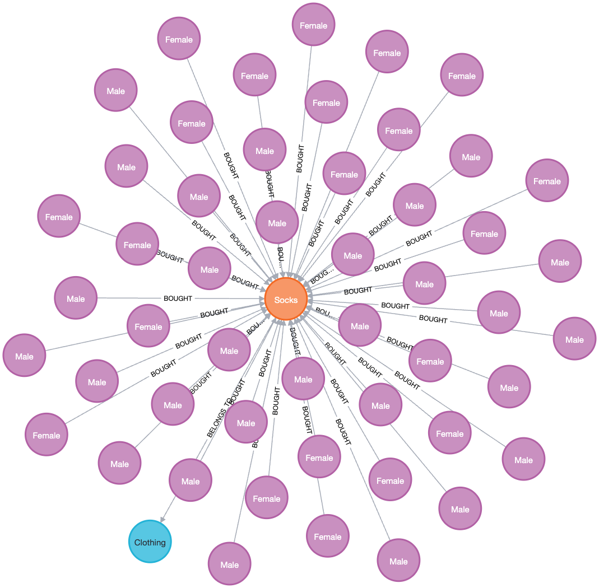

# Proyecto NoSQL – Neo4J

## Análisis de comportamiento de compra (Shopping Behaviour and Product Ranking Dataset)

**Institución:** Universidad Autónoma de Yucatán  
**Asignatura:** Modelos de Datos LCC  
**Profesor:** M. en C. Luis R. Basto Díaz  
**Periodo:** Agosto–Diciembre 2025
**Equipo:** 5  
**Integrantes:**

- Abdala Aguiar Elias Abud – 22216297  
- Nombre 2 – Matrícula  
- Nombre 3 – Matrícula

**Fecha de entrega:** 02/12/2025

---

## 1. Descripción general del proyecto

Este repositorio contiene el desarrollo del **proyecto final de Bases de Datos NoSQL** para la asignatura *Modelos de Datos LCC*.  
El objetivo es:

- Seleccionar un **dataset de Kaggle** que pueda ser modelado con una base de datos NoSQL.
- Modelar dicho dataset en **Neo4J** (base de datos orientada a grafos).
- Importar los datos a Neo4J.
- Definir y documentar **sentencias CRUD (Create, Read, Update, Delete)** sobre el modelo de grafos.
- Documentar todo el proceso en este repositorio.

La base de datos NoSQL asignada al equipo es **Neo4J**.

---

## 2. Dataset

- **Nombre del dataset:** Shopping Behaviour and Product Ranking Dataset  
- **Fuente:** Kaggle  
- **Enlace:** <https://www.kaggle.com/datasets/nalisha/shopping-behaviour-and-product-ranking-dateset>
- **Archivo principal:** `data/shopping_behavior.csv`  

### 2.1. ¿En qué consiste?

El dataset describe el **comportamiento de compra de clientes** en una tienda minorista.  
Cada fila representa una compra realizada por un cliente e incluye:

- Datos demográficos (edad, género, ubicación).
- Información del producto comprado.
- Monto de la compra.
- Temporada del año.
- Calificación del cliente.
- Información de compras previas y método de pago.

Este conjunto de datos es adecuado para Neo4J porque permite modelar una red de:

- **Clientes**
- **Productos**
- **Categorías de producto**

conectados mediante relaciones de compra.

---

## 3. Diccionario de datos

A continuación se describen las columnas del archivo `shopping_behavior.csv`:

| Columna                   | Tipo (CSV) | Tipo lógico   | Descripción                                                          |
|---------------------------|-----------:|---------------|----------------------------------------------------------------------|
| `Customer ID`             | int        | entero        | Identificador único del cliente.                                    |
| `Age`                     | int        | entero        | Edad del cliente.                                                   |
| `Gender`                  | string     | cadena        | Género del cliente (por ejemplo, `Male`, `Female`).                 |
| `Item Purchased`          | string     | cadena        | Nombre del producto comprado.                                       |
| `Category`                | string     | cadena        | Categoría del producto (por ejemplo, `Clothing`, `Footwear`).       |
| `Purchase Amount (USD)`   | int        | numérico      | Monto de la compra en dólares estadounidenses.                      |
| `Location`                | string     | cadena        | Estado o lugar donde se realizó la compra.                          |
| `Size`                    | string     | cadena        | Talla del producto (por ejemplo, `S`, `M`, `L`).                    |
| `Color`                   | string     | cadena        | Color del producto.                                                 |
| `Season`                  | string     | cadena        | Temporada del año (`Spring`, `Summer`, `Autumn`, `Winter`).         |
| `Review Rating`           | float      | numérico real | Calificación otorgada por el cliente (escala aproximada 1.0–5.0).   |
| `Subscription Status`     | string     | cadena        | Indica si el cliente está suscrito (`Yes`/`No`).                    |
| `Discount Applied`        | string     | cadena        | Indica si se aplicó descuento (`Yes`/`No`).                         |
| `Previous Purchases`      | int        | entero        | Número de compras previas realizadas por el cliente.                |
| `Payment Method`          | string     | cadena        | Método de pago (`Cash`, `Credit Card`, `PayPal`, etc.).            |
| `Frequency of Purchases`  | string     | cadena        | Frecuencia de compra (`Weekly`, `Monthly`, `Fortnightly`, etc.).    |

---

## 4. Modelado del dataset en Neo4J (grafos)

Para modelar el dataset en Neo4J se definieron los siguientes **tipos de nodos** y **relaciones**:

### 4.1. Nodos

1. **Cliente**  
   Etiqueta: `:Customer`  
   Propiedades:
   - `customerId` (INT) – tomado de `Customer ID`
   - `age` (INT) – `Age`
   - `gender` (STRING) – `Gender`
   - `location` (STRING) – `Location`
   - `subscriptionStatus` (STRING) – `Subscription Status`
   - `previousPurchases` (INT) – `Previous Purchases`
   - `frequency` (STRING) – `Frequency of Purchases`

2. **Producto**  
   Etiqueta: `:Product`  
   Propiedades:
   - `name` (STRING) – `Item Purchased`
   - `size` (STRING) – `Size`
   - `color` (STRING) – `Color`
   - `season` (STRING) – `Season`
   - `avgReviewRating` (FLOAT, opcional) – promedio de `Review Rating`

3. **Categoría**  
   Etiqueta: `:Category`  
   Propiedades:
   - `name` (STRING) – `Category`

### 4.2. Relaciones

1. **Relación de compra**  
   `(:Customer)-[:BOUGHT]->(:Product)`  
   Propiedades:
   - `amount` (FLOAT) – `Purchase Amount (USD)`
   - `discountApplied` (STRING) – `Discount Applied`
   - `reviewRating` (FLOAT) – `Review Rating`
   - `paymentMethod` (STRING) – `Payment Method`

2. **Relación de pertenencia**  
   `(:Product)-[:BELONGS_TO]->(:Category)`

Este modelo permite analizar:

- Qué productos compra cada cliente.
- Qué categorías son más populares.
- Comportamiento de compra por temporada, ubicación, género, etc.

### 4.3. Visualización del modelo de grafo

  
*Visualización del esquema de nodos y relaciones implementado en Neo4J para el dataset de comportamiento de compra.*

- Archivo editable del diagrama: [`docs/modelo_grafo.drawio`](docs/modelo_grafo.drawio)

### 4.4. Ejemplo de subgrafo con datos reales

  
*Captura de un subgrafo real tras la importación, mostrando clientes, productos y categorías conectados por compras.*

---

## 5. Herramientas utilizadas

- **Neo4J Desktop / Neo4J Browser** – Creación de la base de datos de grafos, ejecución de sentencias Cypher y visualización de nodos y relaciones.  
- **Cypher** – Lenguaje de consulta para Neo4J (definición de nodos, relaciones y CRUD).  
- **Git y GitHub** – Control de versiones y alojamiento del repositorio del proyecto.  
- **Editor de texto / IDE** (por ejemplo, VS Code) – Edición de archivos `.cypher`, `.md` y scripts relacionados.  

---

## 6. Proceso de importación de datos

El proceso general para importar el dataset a Neo4J fue el siguiente:

1. **Preparación del archivo CSV**
   - Descarga del dataset desde Kaggle.
   - Verificación de codificación (`UTF-8`) y delimitador (coma).
   - Renombrado del archivo a `shopping_behavior.csv` y colocación en la carpeta `data/`.

2. **Copia del archivo al directorio de importación de Neo4J**
   - Se copió `shopping_behavior.csv` al directorio `import` de la instancia de Neo4J.

3. **Creación de restricciones e índices**
   - Se definieron restricciones de unicidad para `Customer.customerId` y `Category.name`.

4. **Carga de nodos**
   - Uso de sentencias `LOAD CSV WITH HEADERS` para crear nodos `Customer`, `Product` y `Category`.

5. **Creación de relaciones**
   - A partir de las mismas filas del CSV se crearon relaciones `BOUGHT` y `BELONGS_TO`.

Los scripts Cypher correspondientes se encuentran en la carpeta `neo4j/`:

- `constraints.cypher`
- `import_nodes.cypher`
- `import_relationships.cypher`

Estos archivos ya están completos y listos para ejecutarse tanto desde Neo4J Browser (`:source`) como dentro del contenedor Docker (ver `neo4j-docker/README.md` para los comandos con `docker compose exec cypher-shell`).

---

## 7. Operaciones CRUD en Neo4J

En este proyecto se definieron **5 sentencias para cada operación CRUD**, totalizando 20 operaciones documentadas en el archivo `neo4j/crud.cypher`.

### 7.1. CREATE (Crear) - 5 operaciones

1. **C1: Crear un nuevo cliente**

   ```cypher
   CREATE (:Customer {
       customerId: 9999,
       age: 28,
       gender: 'Female',
       location: 'California',
       subscriptionStatus: 'Yes',
       previousPurchases: 5,
       frequency: 'Monthly'
   });
   ```

   *Crea un nuevo nodo de tipo Customer con todas sus propiedades.*

2. **C2: Crear una nueva categoría**

   ```cypher
   CREATE (:Category {name: 'Electronics'});
   ```

   *Agrega una nueva categoría de productos al sistema.*

3. **C3: Crear un nuevo producto**

   ```cypher
   CREATE (:Product {
       name: 'Smart Watch',
       size: 'M',
       color: 'Black',
       season: 'All Season',
       avgReviewRating: 4.5
   });
   ```

   *Inserta un nuevo producto con sus características.*

4. **C4: Crear una relación de compra**

   ```cypher
   MATCH (c:Customer {customerId: 1})
   MATCH (p:Product {name: 'Blouse'})
   CREATE (c)-[:BOUGHT {
       amount: 53.0,
       discountApplied: 'Yes',
       reviewRating: 3.1,
       paymentMethod: 'Venmo'
   }]->(p);
   ```

   *Establece una relación BOUGHT entre un cliente existente y un producto, incluyendo detalles de la transacción.*

5. **C5: Crear producto con su categoría simultáneamente**

   ```cypher
   CREATE (p:Product {
       name: 'Running Shoes',
       size: 'L',
       color: 'Blue',
       season: 'Summer',
       avgReviewRating: 4.2
   })-[:BELONGS_TO]->(c:Category {name: 'Footwear'});
   ```

   *Crea un producto y lo relaciona con su categoría en una sola operación.*

### 7.2. READ (Leer) - 5 operaciones

1. **R1: Obtener clientes mayores de 50 años**

   ```cypher
   MATCH (c:Customer)
   WHERE c.age > 50
   RETURN c.customerId, c.age, c.gender, c.location
   ORDER BY c.age DESC;
   ```

   *Consulta clientes filtrados por edad, ordenados de mayor a menor.*

2. **R2: Productos más comprados (Top 10)**

   ```cypher
   MATCH (c:Customer)-[b:BOUGHT]->(p:Product)
   RETURN p.name, COUNT(b) AS totalPurchases, AVG(b.amount) AS avgPrice
   ORDER BY totalPurchases DESC
   LIMIT 10;
   ```

   *Analiza los productos con mayor número de compras y su precio promedio.*

3. **R3: Clientes que compraron en categoría específica**

   ```cypher
   MATCH (c:Customer)-[:BOUGHT]->(p:Product)-[:BELONGS_TO]->(cat:Category {name: 'Clothing'})
   RETURN DISTINCT c.customerId, c.age, c.gender, c.location, COUNT(p) AS productsBought
   ORDER BY productsBought DESC;
   ```

   *Encuentra clientes interesados en una categoría particular y cuántos productos de esa categoría compraron.*

4. **R4: Promedio de compra por método de pago**

   ```cypher
   MATCH (c:Customer)-[b:BOUGHT]->(p:Product)
   RETURN b.paymentMethod, 
          COUNT(b) AS totalTransactions,
          AVG(b.amount) AS avgAmount,
          SUM(b.amount) AS totalAmount
   ORDER BY totalAmount DESC;
   ```

   *Agrupa transacciones por método de pago con estadísticas de monto.*

5. **R5: Clientes premium (suscripción activa + muchas compras)**

   ```cypher
   MATCH (c:Customer)
   WHERE c.subscriptionStatus = 'Yes' AND c.previousPurchases > 20
   RETURN c.customerId, c.age, c.location, c.previousPurchases, c.frequency
   ORDER BY c.previousPurchases DESC;
   ```

   *Identifica clientes de alto valor con suscripción activa y alto historial de compras.*

### 7.3. UPDATE (Actualizar) - 5 operaciones

1. **U1: Actualizar edad de un cliente**

   ```cypher
   MATCH (c:Customer {customerId: 1})
   SET c.age = 56
   RETURN c.customerId, c.age;
   ```

   *Modifica la edad de un cliente específico.*

2. **U2: Cambiar estado de suscripción por ubicación**

   ```cypher
   MATCH (c:Customer {location: 'Kentucky'})
   SET c.subscriptionStatus = 'No'
   RETURN c.customerId, c.location, c.subscriptionStatus;
   ```

   *Actualiza masivamente el estado de suscripción de clientes en una ubicación.*

3. **U3: Recalcular rating promedio de un producto**

   ```cypher
   MATCH (p:Product {name: 'Blouse'})<-[b:BOUGHT]-()
   WITH p, AVG(b.reviewRating) AS newAvgRating
   SET p.avgReviewRating = newAvgRating
   RETURN p.name, p.avgReviewRating;
   ```

   *Calcula y actualiza el promedio de calificaciones basado en todas las compras del producto.*

4. **U4: Incrementar contador de compras previas**

   ```cypher
   MATCH (c:Customer {customerId: 2})
   SET c.previousPurchases = c.previousPurchases + 1
   RETURN c.customerId, c.previousPurchases;
   ```

   *Incrementa el contador de compras cuando un cliente realiza una nueva compra.*

5. **U5: Actualizar múltiples propiedades de un producto**

   ```cypher
   MATCH (p:Product {name: 'Smart Watch'})
   SET p.color = 'Silver',
       p.avgReviewRating = 4.7,
       p.season = 'Winter'
   RETURN p;
   ```

   *Modifica varias características de un producto en una sola operación.*

### 7.4. DELETE (Eliminar) - 5 operaciones

1. **D1: Eliminar un cliente y todas sus relaciones**

   ```cypher
   MATCH (c:Customer {customerId: 9999})
   DETACH DELETE c;
   ```

   *Elimina un cliente específico junto con todas sus relaciones (DETACH DELETE).*

2. **D2: Eliminar compras con calificación baja**

   ```cypher
   MATCH ()-[b:BOUGHT]->()
   WHERE b.reviewRating < 2.0
   DELETE b;
   ```

   *Elimina relaciones de compra que tienen calificaciones muy bajas.*

3. **D3: Eliminar productos nunca comprados**

   ```cypher
   MATCH (p:Product)
   WHERE NOT (p)<-[:BOUGHT]-()
   DELETE p;
   ```

   *Limpia productos que no tienen ninguna compra registrada.*

4. **D4: Eliminar relación producto-categoría**

   ```cypher
   MATCH (p:Product {name: 'Running Shoes'})-[r:BELONGS_TO]->()
   DELETE r;
   ```

   *Elimina la asociación entre un producto y su categoría.*

5. **D5: Eliminar clientes inactivos**

   ```cypher
   MATCH (c:Customer)
   WHERE c.subscriptionStatus = 'No' AND c.previousPurchases = 0
   DETACH DELETE c;
   ```

   *Elimina clientes sin suscripción y sin historial de compras.*

---

**Nota:** Todas estas sentencias están completamente documentadas en el archivo `neo4j/crud.cypher` con ejemplos adicionales y consultas útiles.

---

## 8. Estructura del repositorio

```text
proyecto-nosql-neo4j-equipo5/
├── data/
│   └── shopping_behavior.csv
├── docs/
│   ├── diccionario_datos.md
│   ├── modelo_grafo.drawio
│   ├── modelo_grafo.png
│   ├── subgrafo_datos_reales.png
│   ├── Cliente nuevo.jpg
│   ├── ConsultaMayorA50.jpg
│   ├── ActualizarEdad.jpg
│   └── Cliente9999eliminado.jpg
├── neo4j/
│   ├── constraints.cypher
│   ├── import_nodes.cypher
│   ├── import_relationships.cypher
│   └── crud.cypher
├── neo4j-docker/
│   ├── docker-compose.yml
│   ├── README.md
│   ├── conf/
│   ├── data/
│   ├── import/
│   ├── logs/
│   └── plugins/
└── README.md
```

---

## 9. Conclusiones

- El modelo de grafos en Neo4J permitió integrar clientes, productos y categorías de forma natural, facilitando consultas analíticas (top productos, clientes por edad, métodos de pago).
- El proceso de importación con `LOAD CSV` más constraints e índices asegura integridad (unicidad de clientes/productos) y buen rendimiento en las consultas CRUD.
- Las evidencias en Neo4J Browser muestran que las operaciones CRUD funcionan y el dataset se representa correctamente en el grafo.
- El contenedor Docker estandariza la puesta en marcha: cualquier integrante puede recrear el entorno y cargar los datos con los scripts incluidos.
- El dataset de Kaggle resulta adecuado para grafos al capturar relaciones de compra y pertenencia; se pueden extender análisis a recomendaciones y segmentación.

---

## 10. Referencias

- **Kaggle – Shopping Behaviour and Product Ranking Dataset:**  
  <https://www.kaggle.com/datasets/nalisha/shopping-behaviour-and-product-ranking-dateset>

- **Neo4J – Documentación oficial:**  
  <https://neo4j.com/docs/>

- **Cypher Query Language:**  
  <https://neo4j.com/developer/cypher/>
